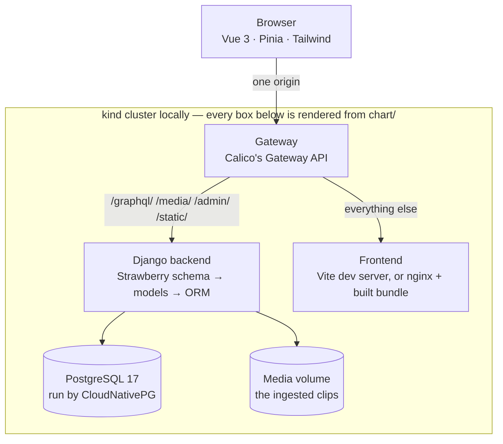

# Tech Stack

> **Background document.** `openspec/specs/` is normative for required behavior.
> This file records the technology choices and their rationale.

## Architecture Overview



The browser reaches exactly one address. That is the point of the Gateway, and it
is why the backend carries no CORS configuration at all: there is no cross-origin
request left to permit.

The same chart renders both environments — development supplies values generated
from `.env`, a deployment supplies its own. The two places they genuinely differ
are values with both branches implemented: `frontend.mode` picks the dev server or
the built bundle, and `media.hostPath` picks the shared host directory or ordinary
provisioned storage.

## Infrastructure

| Layer | Choice | Version | Reason |
|---|---|---|---|
| Local cluster | kind | 0.33+ | The whole stack runs in Kubernetes locally, so development and a deployment have the same shape |
| Container runtime | Docker or Podman (rootless) | Latest | Either works, as long as Tilt's `DOCKER_HOST` and kind's provider name the same one. Podman needs kind 0.33+: 0.32 cannot drive podman 6, whose `ps --format` reports labels as a slice |
| Dev orchestration | Tilt | Latest | One command brings the stack up, syncs source into running pods, and isolates each worktree |
| CNI + Gateway | Calico | 3.32 | One project for both pod networking and the Gateway API implementation (`tigera-gateway-class`), which is what puts the app on a single origin |
| PostgreSQL operator | CloudNativePG | 1.30 | The manifest describes a database rather than a pod that happens to run one |
| Storage | kind's local-path, plus a hostPath volume | — | The database provisions per worktree; the audio is one host directory shared by all of them, so ingestion happens once and survives cluster deletion |
| Deployment description | Helm | 3 | One chart rendered with different values, rather than a manifest per environment |

`chart/` is the stack — the only description of it, rendered by Tilt with
generated development values and by a deployment with its own. `k8s/` holds what
the cluster needs *before* the stack (the kind config and the Calico bootstrap),
`Tiltfile` the bring-up, and `scripts/worktree-env.sh` the mapping from a git
worktree to its namespace and port. Configuration lives in one git-ignored `.env`
read by both the cluster and any host-run command; the database's own credentials
are generated by CloudNativePG and never written down.

Where development and a deployment genuinely differ, the difference is a value
with both branches implemented rather than a paragraph describing one of them:
`frontend.mode` runs the dev server or the built bundle behind nginx, and
`media.hostPath` chooses the shared host directory or ordinary provisioned
storage. Development runs the same templates a deployment installs, so neither
branch is the one nobody has ever rendered.

## Backend

| Layer | Choice | Version | Reason |
|---|---|---|---|
| Framework | Django | latest | Established, mature, large ecosystem |
| API | Strawberry GraphQL | latest | Less boilerplate than DRF, auto introspection, type safe |
| Database | PostgreSQL | 17 (latest) | FK integrity, full-text search, ACID compliance |
| DB driver | psycopg (binary) | latest | Native async, type hinting over psycopg2 |
| Storage | Django FileField | — | Audio files stored on filesystem via `MEDIA_ROOT` |
| Package manager | uv | 0.12 | One lockfile, resolution in about a second, and the same tool installs Python itself. `uv sync --locked` in the image fails the build on a stale lock rather than resolving something new |
| WSGI server | Gunicorn | latest | Standard for Django production deployment |
| Tests | pytest + pytest-django | latest | Python testing standard with Django integration |

## Frontend

| Layer | Choice | Version | Reason |
|---|---|---|---|
| Framework | Vue | latest | Reactivity, options + composition API, smaller than Angular |
| Build | Vite | latest | Fast HMR, modern, lighter than webpack |
| State | Pinia | latest | Official Vue store, simpler than Vuex |
| Routing | vue-router | latest | Official, well-integrated |
| HTTP | native fetch, same-origin | — | The Gateway routes `/graphql/` to Django, so there is no cross-origin request and no CORS package |
| Keyboard | Custom component | — | On-screen Thai characters, no external dependency |
| Thai font | Noto Sans Thai Looped (variable) | 5.x via `@fontsource-variable` | Looped heads are how a beginner tells Thai letters apart; self-hosted, so no font CDN and no offline gap |
| Unit tests | Vitest | latest | Same Vite pipeline, no second build config |
| Browser tests | Playwright (Chromium) | latest | A loaded font, a playing clip, and a stable layout are only true on screen; stubs the backend so no database is needed |

Tailwind 4 is configured through the `@tailwindcss/vite` plugin and a single
`@import "tailwindcss";` in the stylesheet. There is no `tailwind.config.js`, no
`npx tailwindcss init`, and no separate PostCSS/autoprefixer step — those belong to
Tailwind 3 and its `init -p` command was removed in v4.

| Styling | Tailwind CSS | 4.x (latest) | Utility-first, fast iteration, clean default output |

## Data Layer

| Layer | Choice | Notes |
|---|---|---|
| Corpus source | Mozilla Common Voice | CC-0 license, 150+ languages, Thai release 25.0 |
| Corpus location | Release directory `cv-corpus-25.0-2026-03-09/th`, path supplied to the ingestion script | 9.6 GB, **outside the repository**, read in place and never committed |
| Selection source | `validated.tsv` | 148,765 rows; the only manifest carrying both a clip `path` and vote counts |
| Clip durations | `clip_durations.tsv` | 366,508 rows mapping clip filename → duration in ms |
| Audio | `clips/*.mp3` | 366,508 files; only the ~100 selected clips are copied into `MEDIA_ROOT` |
| MVP dataset | JSON file | `data/processed/mvp_dataset.json`, produced by the ingestion script |
| MVP count | 100 exercises | Selected by the criteria below |
| Database | PostgreSQL | `exercises`, `progress` tables with FK relationships |

### Why not `validated_sentences.tsv`

An earlier draft named `validated_sentences.tsv` as the MVP source with an
`up_votes >= 2` filter. That is not implementable: the file's columns are
`sentence_id, sentence, variant, sentence_domain, source, is_used, clips_count` —
**no `up_votes` and no clip path**. It is a sentence list, not a clip manifest, so
it can never yield a playable exercise. `validated.tsv` carries `client_id, path,
sentence_id, sentence, sentence_domain, up_votes, down_votes, age, gender, accents,
variant, locale, segment` and is the correct source.

### MVP selection criteria

| Criterion | Value |
|---|---|
| Quality | `up_votes >= 2` and `down_votes == 0` |
| Sentence length | 10–25 characters inclusive |
| Clip duration | ≤ 6000 ms |
| Clip present | referenced `.mp3` exists under `clips/` |
| Uniqueness | one exercise per distinct sentence |

Measured against the corpus on disk: 132,153 rows pass the quality filter, and
after the length and duration filters **21,432 unique sentences** remain — ample
headroom to sample 100. Selection is deterministic: the same corpus and seed
produce the same 100 exercises every run.

### Difficulty is derived

Common Voice carries **no difficulty field**. `difficulty` (1–5) is computed at
ingestion time from sentence character length and clip duration, the two available
proxies for how hard a sentence is to type by ear. The derivation inputs are stored
so the score can be recomputed when a better model (tone-mark density, cluster
complexity) replaces the coarse one.

## Project Structure

`TypeLearn/` (this repo — specs + scaffolding only, code generated with CLI commands from roadmap M1)

```
TypeLearn/
├── specs/                         # Spec files (this directory)
│   ├── mission.md
│   ├── roadmap.md
│   └── tech-stack.md
├── openspec/                      # Normative capability specs and changes
├── .gitignore                     # data/, __pycache__, .venv/, node_modules/
└── README.md                      # Clone this, run M1 commands, you have a running app
```

After running M1 commands, the code tree becomes:

```
TypeLearn/
├── specs/                         # Background docs (this directory)
│   ├── mission.md
│   ├── roadmap.md
│   └── tech-stack.md
├── openspec/                      # Normative capability specs and changes
├── src/
│   ├── backend/
│   │   ├── manage.py
│   │   ├── pyproject.toml
│   │   ├── typelearn/
│   │   │   ├── settings.py
│   │   │   ├── urls.py
│   │   │   └── wsgi.py
│   │   └── exercises/
│   │       ├── models.py
│   │       ├── schema.py
│   │       └── utils.py
│   └── frontend/
│       ├── package.json
│       ├── vite.config.js
│       └── src/
│           ├── main.js
│           ├── App.vue
│           └── components/
├── chart/                         # The stack: one chart, rendered per environment
│   ├── values.yaml                # Deployment-shaped defaults
│   ├── values-prod.yaml.example   # A deployment's starting point
│   └── templates/
├── k8s/                           # What the cluster needs before the stack
│   ├── kind.yaml                  # Generated per machine by scripts/kind-config.sh
│   ├── calico-installation.yaml
│   └── calico-gatewayapi.yaml
├── scripts/
│   ├── kind-config.sh             # Renders kind.yaml with this machine's paths
│   └── worktree-env.sh            # Worktree → namespace, port
├── Tiltfile                       # Bring-up: renders chart/ with values from .env
├── .env                           # Backend configuration, git-ignored
├── data/                          # Large files, .gitignore'd
│   ├── processed/                 # mvp_dataset.json
│   └── media/                     # MEDIA_ROOT — the ~100 selected clips,
│                                  #   shared by every worktree via a hostPath
└── .gitignore
```

The Common Voice corpus is **not** part of this tree. It lives outside the
repository in the release directory `cv-corpus-25.0-2026-03-09/`, is
read in place by the ingestion script, and only the selected clips are copied into
`data/media/`. The corpus path is a parameter of the ingestion script, not a
hardcoded constant.

## Data Model (MVP)

### `Exercise`

```python
class Exercise(models.Model):
    sentence = CharField(max_length=255, unique=True)   # Thai text to type
    sentence_id = CharField(max_length=64, blank=True)  # Common Voice source ID
    original_audio = FileField()                        # Path to audio clip
    up_votes = IntegerField(default=0)                  # Validation quality indicator
    difficulty = IntegerField(default=1)                # 1-5 scale, derived at ingestion
    created_at = DateTimeField(auto_now_add=True)
```

Every `CharField` declares an explicit `max_length`. Django raises system check
error `fields.E120` for a `CharField` without one, and that check blocks *every*
management command — `migrate`, `test`, `runserver` included.

### `Progress`

```python
class Progress(models.Model):
    exercise = ForeignKey(Exercise, on_delete=CASCADE)
    typed_text = CharField(max_length=255)
    is_correct = BooleanField()
    attempts = IntegerField(default=0)
    created_at = DateTimeField(auto_now_add=True)
```

## API Contract

### GraphQL Schema

```graphql
type Exercise {
  id: ID!
  sentence: String!
  sentenceId: String
  audioUrl: String!
  upVotes: Int!
  difficulty: Int!
}

type Query {
  exercises(limit: Int): [Exercise!]!
  exercise(id: ID!): Exercise
}
```

**Field names are camelCase.** Strawberry applies `auto_camel_case` by default, so
the Python fields `sentence_id`, `audio_url`, and `up_votes` are published as
`sentenceId`, `audioUrl`, and `upVotes`. This project does **not** disable that
default — camelCase is the GraphQL convention and what client tooling expects — so
a query written in snake_case fails validation with "Cannot query field".

### Client API

| Action | Query / Mutation |
|---|---|
| Load next exercise | `{ exercises { id sentence audioUrl difficulty } }` |
| Load a single exercise | `{ exercises(limit: 1) { id sentence audioUrl } }` |
| Record attempt | (client-side only for MVP, no backend write) |
| Replay audio | `<audio src="{exercise.audioUrl}">` |

### Data flow

1. `GET { exercises }` → returns 100 exercises from DB
2. Frontend picks one → displays `sentence` in large text
3. User presses play → HTML5 `<audio>` loads from `audioUrl`
4. User types via virtual keyboard → `typed` ref updates
5. User presses Check → compares `typed` with `expected.sentence` client-side
6. Result shown → on correct: picks next exercise automatically

## Technology Decisions

| Tool | Status | Rationale |
|---|---|---|
| Podman / podman-compose | Out | Replaced by kind + Tilt; podman also cannot back kind at the versions installed |
| Django REST Framework | Out | Switched to Strawberry GraphQL — less boilerplate, type safety |
| pip / pip-tools | Out | Superseded by uv, which also replaced Poetry |
| Poetry | Out | Replaced by uv. `pyproject.toml` was already PEP 621, so the move was deleting Poetry's half of it; every pinned version came out identical |
| psycopg2 | Out | Outdated; chose psycopg3 for async support |
| Docker / Kubernetes | **In** — local development | A local kind cluster is what removes the two-origin split; deployment itself is still out of scope |
| kustomize | Out | Replaced by the Helm chart. Expressing a second environment meant an overlay patching the same fields, and the patches were never rendered — three of them turned out not to do what they said |
| Redux / Vuex | Out | Chose Pinia as the official Vue state management library |
| Nginx / Caddy | **In** — the chart's `serve` mode | nginx serves the built bundle when `frontend.mode: serve`; development sets `dev` so hot reload survives |
